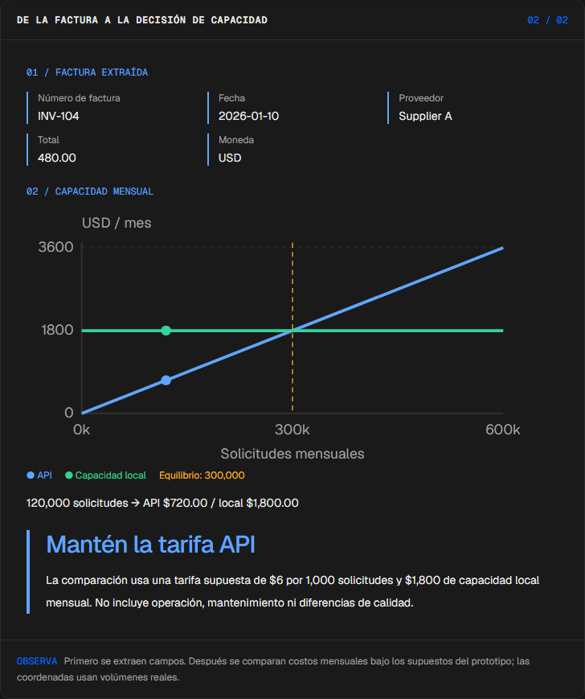
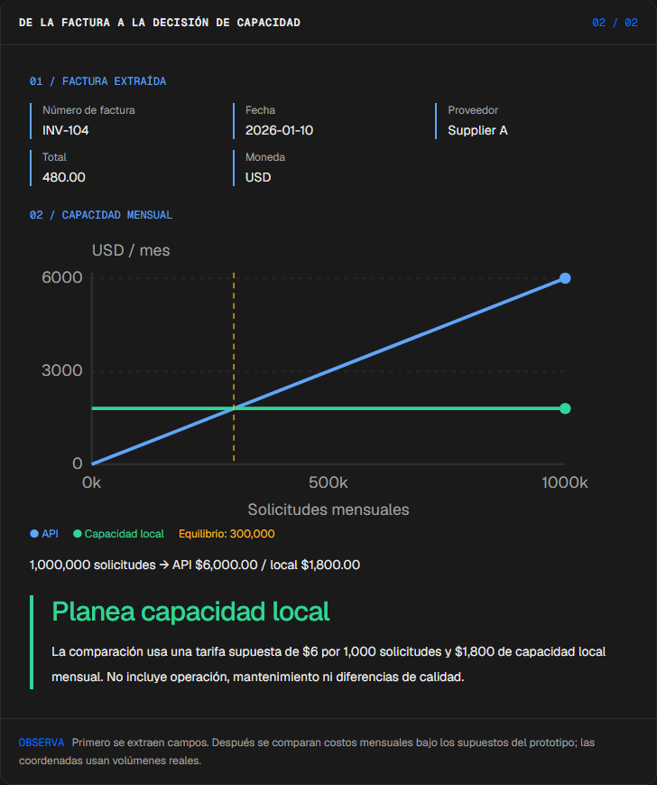
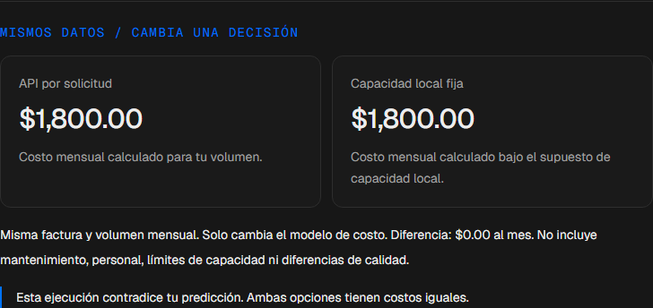
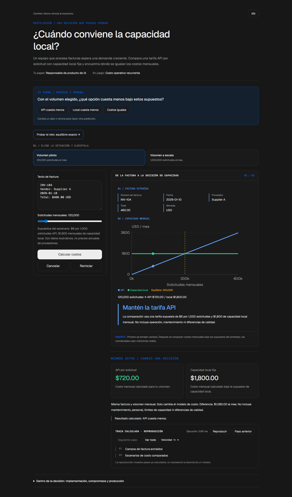

# Destilación

[English](README.md) · [Probar demo](https://destilacion-manueldeasis27-2515s-projects.vercel.app/es/app) · [Caso de estudio](https://manueldeasis.com/es/projects/destilacion) · [Código](https://github.com/mdeasis27/destilacion)


Edita una factura y el volumen mensual para comparar campos extraídos y cruce de costos.

## Dos situaciones para comparar

**Piloto:** 120000 solicitudes La API cuesta menos.



**Escala:** 1000000 solicitudes La capacidad local cuesta menos.



## Caso de uso de negocio

Los costos de extracción se vuelven opacos al cambiar el volumen.

**Quién lo usa:** Responsable de producto.

**La decisión:** Usar tarifa API o capacidad local.

Ingresa evidencia de factura, elige demanda y compara costos calculados.

### Prueba la decisión

**Piloto:** 120000 solicitudes La API cuesta menos.

**Escala:** 1000000 solicitudes La capacidad local cuesta menos.

Elige un escenario, modifica sus controles y ejecuta el cálculo local. Avanza por la visualización paso a paso o revela todo. Reinicia antes de comparar el segundo escenario.

## Cómo probarlo

Abre `/en/app` (inglés, por defecto) o `/es/app` (español). Cambia los datos del escenario y ejecuta el cálculo. Inspecciona la decisión, evidencia y traza calculada. La reproducción revela pasos locales ya completados; no mide un modelo en vivo. Reiniciar empieza un escenario local nuevo. Cambiar de idioma reinicia el escenario.

La demo principal no requiere cuenta, clave de API ni base de datos. Los enlaces públicos apuntan al despliegue existente; el rediseño local está pendiente de publicación.

<!-- recruiter-mission:start -->
### Tu misión interactiva

Prueba el equilibrio exacto de 300,000 solicitudes mensuales, predice qué opción es más barata, calcula y revela la traza completa.

Calcula los costos mensuales de API y capacidad local para la misma factura y demanda. Con 300,000 solicitudes ambas cuestan $1,800 bajo los supuestos ilustrativos; ninguna es más barata. Los cálculos usan centavos enteros.

**Por qué este enfoque:** Un modelo de capacidad transparente expone el cruce antes de elegir infraestructura. La extracción con reglas es un sustituto de estudiante y no demuestra un modelo destilado entrenado ni calidad de extracción equivalente.

**Antes de producción:** Medir calidad en facturas etiquetadas, rendimiento real, utilización, gastos operativos y privacidad. Los supuestos ilustrativos de $6 por 1,000 solicitudes y $1,800 mensuales excluyen mantenimiento, personal y diferencias de calidad.

Editar datos, elegir un escenario o reiniciar borra la predicción y los resultados anteriores. La comparación aparece al completar la reproducción; las demos principales no requieren cuenta ni llave.

El piloto de misiones actualiza esta implementación. Las capturas e informes de navegador existentes documentan la etapa anterior; las comprobaciones de interacción y capturas nuevas están pendientes por bloqueos del entorno actual.

<!-- recruiter-mission:end -->

## Instalación y verificación local

Requiere Node.js 22 y pnpm 10.

```sh
pnpm install --frozen-lockfile
pnpm dev
pnpm test
node node_modules/typescript/bin/tsc --noEmit --incremental false
pnpm lint
pnpm build
```

Abre `http://localhost:3000/en/app`. La validación registrada cubre pruebas, lint, TypeScript y builds de producción. Consulta los [resultados de comandos](docs/quality/decision-lab-verification.json) y las [comprobaciones de componentes en navegador](docs/quality/decision-lab-browser.json). Estas pruebas usan componentes React y CSS de producción con navegación de idioma controlada; no certifican rutas de Next ni el despliegue público.

## Arquitectura

- `app/[lang]/`: experiencia web por idioma.
- `lib/experience/`: adaptador local tipado, validación y trazas.
- `design-system/`: tokens visuales, controles de idioma y presentación de ejecución y reproducción.
- `app/api/`: integraciones opcionales de servidor; la demo principal no las requiere.

Tecnología: Next.js 16, TypeScript, Python, Vitest, pytest, Tailwind CSS v4.

## Evidencia y límites

Campos de factura alimentan dos curvas de costo.

Proxy de estudiante basado en reglas y modelo de costos supuesto, no benchmark de un modelo entrenado.

Hace inspeccionable el cruce de costos antes del gasto recurrente.

**Límites:** Proxy local basado en reglas; no es una cotización de producción. Estos prototipos de portafolio no afirman impacto medido en producción.

Los datos son ejemplos ficticios o anónimos. Las integraciones opcionales requieren sus propias credenciales y configuración. Los secretos pertenecen al gestor configurado, nunca a archivos locales de secretos ni Git. Usa el flujo existente `infisical run -- <command>` si necesitas integraciones en vivo. La demo local no publica ni despliega automáticamente.


