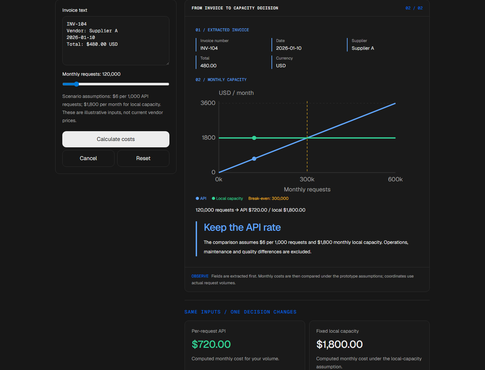
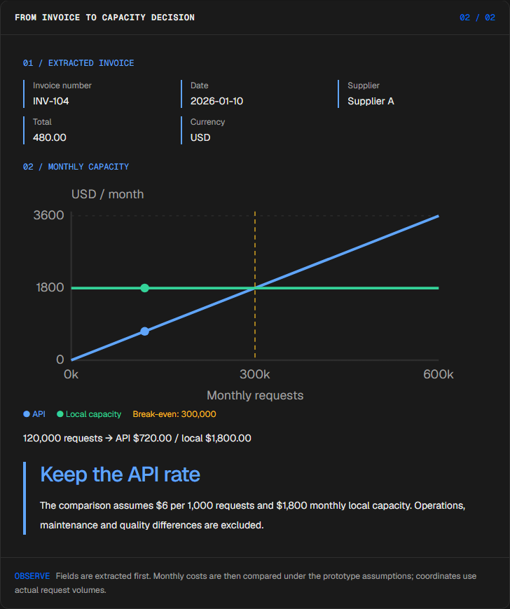
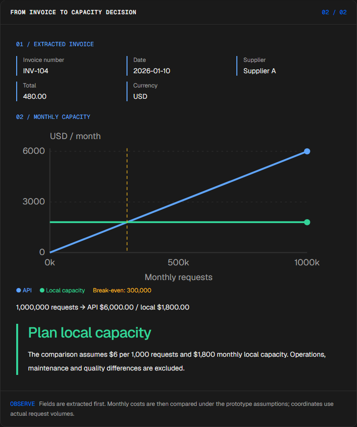
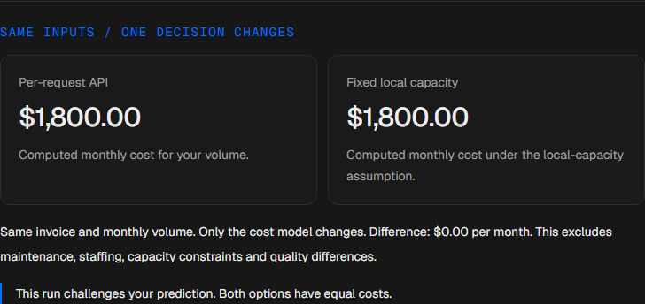
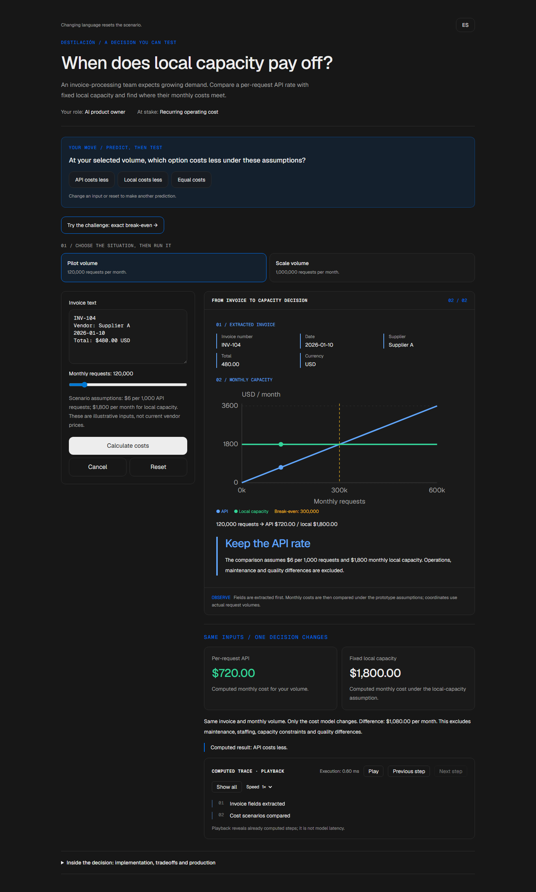

# Extraction cost tradeoff

<!-- community-badges -->
[](https://github.com/mdeasis27/destilacion/actions/workflows/ci.yml) [](LICENSE)
<!-- /community-badges -->

[Español](README.es.md) · [Try the demo](https://destilacion-manueldeasis27-2515s-projects.vercel.app/en/app) · [Case study](https://portafolio-mdea.vercel.app/en/projects/destilacion) · [Source](https://github.com/mdeasis27/destilacion)



Edit an invoice and monthly request volume to compare extracted fields and cost crossover.

## Two situations to compare

**Pilot:** 120000 requests API cost is lower.



**Scale:** 1000000 requests Local capacity is lower.



## Business use case

Extraction costs become opaque as volume changes.

**Who uses it:** Product owner.

**The decision:** Use an API rate or local capacity.

Enter invoice evidence, choose a demand preset, then compare computed costs.

### Try the decision

**Pilot:** 120000 requests API cost is lower.

**Scale:** 1000000 requests Local capacity is lower.

Choose a scenario, edit its controls and run the local computation. Step through the visual process or reveal all steps. Reset before comparing the second scenario.

## How to try it

Open `/en/app` (English, default) or `/es/app` (Spanish). Change the scenario inputs and run the computation. Inspect the resulting decision, evidence and computed trace. Playback reveals completed local steps; it does not measure a live model. Reset starts a new local scenario. Changing language resets the scenario.

The primary demo needs no account, API key or database. Public links refer to the existing deployment; local redesign changes are pending publication.

<!-- recruiter-mission:start -->
### Your interactive mission

Try the exact break-even volume of 300,000 monthly requests, predict which option is cheaper, calculate and reveal the full trace.

Compute API and local-capacity monthly costs for the same invoice and demand. At 300,000 requests both cost $1,800 under the illustrative assumptions; neither is cheaper. All calculations use integer cents.

**Why this approach:** A transparent capacity model exposes the crossover before an infrastructure decision. Rule-based extraction is a student proxy and does not demonstrate a trained distilled model or equal extraction quality.

**Before production:** Measure labeled-invoice quality, real throughput, utilization, operating expenses and data privacy. The illustrative $6 per 1,000 requests and $1,800 monthly capacity exclude maintenance, staffing and quality differences.

Editing inputs, choosing a preset or resetting clears the prediction and obsolete results. Comparisons appear only at completed playback; the primary demos need no account or key.

The mission pilot updates this implementation. Existing screenshots and browser reports document the previous stage; fresh browser interaction checks and captures are pending because the current environment blocked them.

<!-- recruiter-mission:end -->

## Local setup and verification

Requires Node.js 22 and pnpm 10.

```sh
pnpm install --frozen-lockfile
pnpm dev
pnpm test
node node_modules/typescript/bin/tsc --noEmit --incremental false
pnpm lint
pnpm build
```

Open `http://localhost:3000/en/app`. Recorded validation covers tests, lint, TypeScript and production builds. See [command results](docs/quality/decision-lab-verification.json) and [browser component checks](docs/quality/decision-lab-browser.json). The new browser checks exercise real React components and production CSS with controlled locale navigation; they do not certify Next routes or public deployment.

## Architecture

- `app/[lang]/`: localized browser experience.
- `lib/experience/`: typed local adapter, validation and run traces.
- `design-system/`: shared visual tokens, locale controls and execution/replay presentation.
- `app/api/`: optional server integrations; the primary demo does not require them.

Technology: Next.js 16, TypeScript, Python, Vitest, pytest, Tailwind CSS v4.

## Evidence and limitations

Invoice fields flow into two cost curves.

A rule-based student proxy and an assumed cost model, not a trained model benchmark.

Makes the cost crossover inspectable before recurring spend.

**Limits:** Rule-based local proxy; it is not a production quote. These portfolio prototypes do not claim measured production impact.

Inputs use fictional or anonymized examples. Optional live integrations require their own credentials and operational setup. Secrets belong in the configured secret manager, never in local secret files or Git. Use the existing `infisical run -- <command>` workflow when live integration is needed. This repository does not publish or deploy automatically as part of the local demo.



<!-- community-section -->
## License and contributing

Released under the [MIT License](LICENSE). Issues and pull requests are welcome: read [CONTRIBUTING.md](CONTRIBUTING.md) and the [Code of Conduct](CODE_OF_CONDUCT.md) first. To report a vulnerability, see [SECURITY.md](SECURITY.md).
<!-- /community-section -->
